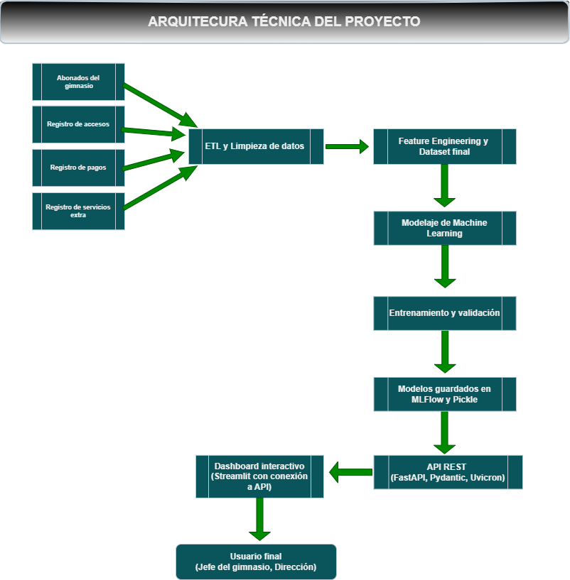
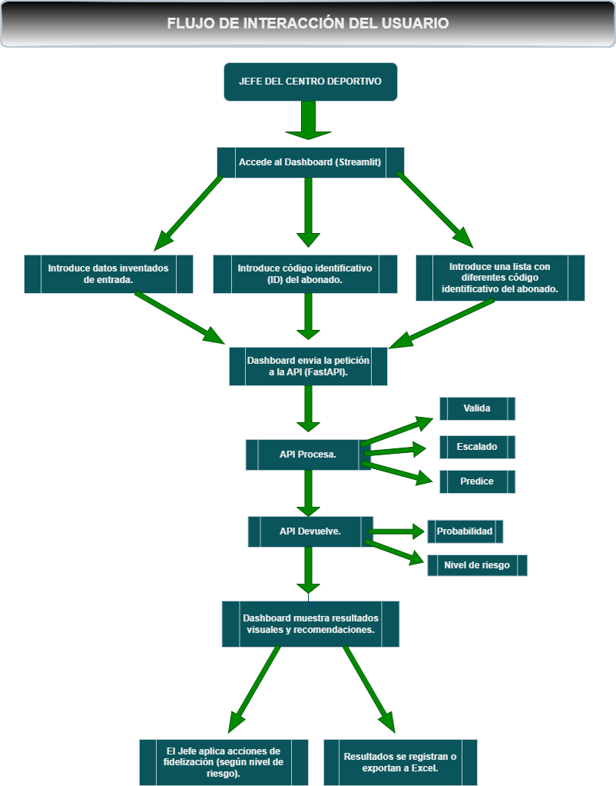

# Predicción de Abandono en Abonados de Centros Deportivos mediante Técnicas de Machine Learning  
*(Caso aplicado al Centre Municipal Horta Esportiva – CEM Horta, Barcelona)*

## 🧠 Contexto del proyecto:

En el sector del fitness, la **retención de abonados** es uno de los principales retos de sostenibilidad. Los centros deportivos suelen enfrentar **tasas de abandono (churn)** superiores al 30 % anual, lo que impacta directamente en ingresos, planificación de recursos y estabilidad operativa.

Este proyecto aborda ese desafío en el **Centre Municipal Horta Esportiva (CEM Horta)**, aplicando **técnicas de Machine Learning** para predecir la probabilidad de baja de cada abonado y ofrecer **estrategias personalizadas de fidelización**.

El sistema combina:
- **Modelos predictivos supervisados.**
- **API de predicción en tiempo real (FastAPI).**
- **Dashboard interactivo (Streamlit).**

De este modo, la analítica avanzada se integra en la gestión diaria del gimnasio, convirtiendo los datos en **decisiones accionables**.

## ⚙️ Características Principales

- 🔍 **Modelo Predictivo:** estima la probabilidad de abandono de cada abonado mediante aprendizaje supervisado.  
- 🧩 **Arquitectura modular reproducible:** basada en principios MLOps con trazabilidad completa.  
- 🚀 **API de inferencia (FastAPI):** permite realizar predicciones en tiempo real.  
- 📊 **Dashboard interactivo (Streamlit):** visualiza niveles de riesgo y sugiere acciones de fidelización.  
- 🧮 **Gestión de experimentos (MLflow):** registro de métricas, artefactos y versiones de modelos.  
- 🔐 **Cumplimiento RGPD:** uso exclusivo de datos anonimizados y respetuosos con la privacidad.


## 📌 Objetivos:

### Objetivo general:

Desarrollar un **sistema predictivo de abandono** que permita al CEM Horta anticipar bajas y diseñar **acciones de retención personalizadas basadas en datos**.


### Objetivos específicos:
1. Analizar patrones de comportamiento, asistencia y actividad de los abonados.
2. Segmentar los usuarios según frecuencia, antigüedad, gasto y nivel de compromiso.
3. Entrenar modelos de machine learning para predecir la probabilidad de abandono.
4. Evaluar su rendimiento mediante métricas robustas (AUC-ROC, F1-score, Recall).
5. Desarrollar una **API y un dashboard interactivo** para la visualización y toma de decisiones.
6. Clasificar los resultados en **niveles de riesgo** (**muy bajo, bajo, medio, alto y muy alto**) y asociar a cada uno **acciones recomendadas** de fidelización.


### 🏗️ Arquitectura del proyecto

El proyecto sigue una metodología modular basada en **CRISP-DM** y principios de **MLOps**, garantizando la trazabilidad, reproducibilidad y escalabilidad del sistema.

> 📷 **Figura 1. Arquitectura general del sistema**  



Resumen de la arquitectura:

1. Pipeline ETL y Feature Engineering:

    - Limpieza, codificación, normalización y cálculo de métricas de asistencia y económicas.
    - Integración final en dataframe_final_abonado.csv.

2. Modelado:

    - Modelos evaluados: Gradient Boosting, Random Forest, SVM, Regresión Logística, KNN.
    - Optimización con GridSearchCV, priorizando Recall y AUC.
    - Registro y trazabilidad con MLflow.

3. API FastAPI:

    - Endpoints para predicción individual, batch y simulada.
    - Devuelve clase, probabilidad, nivel de riesgo y variables explicativas.
    > 📷 **Figura 2. Flujo interno de predicción en la API**  

    

4. Dashboard Streamlit:

    - Consultas por ID, batch y simulación.
    - Visualización de riesgo, importancia de variables y estrategias de fidelización.


## 📊 7. Resultados y análisis


### Distribución de abandonos

- Total de abonados: 6.929
- Abandono (EsChurn = 1): 2.504 (36%)
- Activos (EsChurn = 0): 4.425 (64%)

⚠️ Existe un desbalance moderado que justifica priorizar recall en los modelos sin necesidad de oversampling.

### Experimentos y selección de variables

Se realizaron 3 experimentos para evaluar la relevancia de las variables y evitar multicolinealidad:

| Experimento | Variables destacadas                              | Objetivo                                               |
| ----------- | ------------------------------------------------- | ------------------------------------------------------ |
| 1           | Todas (incluye TotalPagadoEconomia, VidaGymMeses) | Máximo rendimiento                                     |
| 2           | Sin TotalPagadoEconomia                           | Reducir dependencia económica                          |
| 3           | Sin TotalPagadoEconomia ni VidaGymMeses           | Foco en comportamiento real (visitas, actividad, edad) |


Variables económicas y de antigüedad muestran alta correlación, pudiendo sesgar los modelos.

### Modelos y métricas clave

Resumen de los mejores modelos: Gradient Boosting, Random Forest y SVM.

| Modelo            | Exp | Accuracy | Recall | F1    | AUC   |
| ----------------- | --- | -------- | ------ | ----- | ----- |
| Gradient Boosting | 1   | 0.934    | 0.888  | 0.924 | 0.979 |
| Gradient Boosting | 2   | 0.882    | 0.822  | 0.863 | 0.950 |
| Gradient Boosting | 3   | 0.829    | 0.786  | 0.806 | 0.911 |


✅ Gradient Boosting se destaca en todos los experimentos, con alto recall, clave para detectar abandonos.

### 📈 Validación externa

| Experimento | Accuracy | Recall | F1    | AUC   |
| ----------- | -------- | ------ | ----- | ----- |
| 1           | 0.811    | 0.945  | 0.834 | 0.807 |
| 2           | 0.756    | 0.884  | 0.784 | 0.754 |
| 3           | 0.795    | 0.844  | 0.804 | 0.874 |


🔹 Experimento 3 logra el mejor equilibrio entre rendimiento técnico y aplicabilidad de negocio.

### 🌟 Variables más importantes (Top 5)

| Experimento | Variables clave                                                       | Tipo                    |
| ----------- | --------------------------------------------------------------------- | ----------------------- |
| 1           | TotalPagadoEconomia, VidaGymMeses, Edad, TienePagos, TotalVisitas     | Económicas + antigüedad |
| 2           | VidaGymMeses, DíasActivo, TotalVisitas, EstFav_verano, Edad           | Actividad + antigüedad  |
| 3           | DíasActivo, TotalVisitas, Edad, VisitasPrimerTrimestre, VisitasUlt180 | Comportamiento reciente |


🔹 Exp. 3 permite acciones directas y éticas, basadas en actividad y constancia.

### 🎯 Modelo final y estrategia

- Modelo elegido: Gradient Boosting (Exp. 3)
- Motivo: Equilibrio entre precisión, interpretabilidad y aplicabilidad.
- Uso: Alimenta la API y el dashboard para identificar abonados en riesgo y recomendar acciones de fidelización.

Niveles de riesgo y estrategias recomendadas:

| Nivel de Riesgo | Estrategias Recomendadas                                                                                                                                                                                                                                                |
| --------------- | ----------------------------------------------------------------------------------------------------------------------------------------------------------------------------------------------------------------------------------------------------------------------- |
| **Muy Bajo**    | 1. Programa de recompensas por uso continuo.<br>2. Acceso anticipado a nuevas funcionalidades.<br>3. Beneficios por referencia.<br>4. Ofertas personalizadas según hábitos.<br>5. Eventos exclusivos o retos para socios fieles                                         |
| **Bajo**        | 1. Descuentos en renovación.<br>2. Campañas de retargeting personalizadas.<br>3. Notificaciones con recordatorios de valor.<br>4. Descuentos por uso frecuente.<br>5. Recompensas por explorar nuevas funciones                                                         |
| **Medio**       | 1. Ofertas de reactivación personalizadas.<br>2. Recordatorios de funcionalidades no usadas.<br>3. Campañas de contenido exclusivo.<br>4. Acceso temporal a servicios premium.<br>5. Notificaciones de “última oportunidad”                                             |
| **Alto**        | 1. Descuentos agresivos en reactivación.<br>2. Contacto personalizado (correo, llamada o asesoramiento).<br>3. Planes flexibles según uso.<br>4. Campañas urgentes de reactivación.<br>5. Sesiones de soporte o entrenamiento gratuito                                  |
| **Muy Alto**    | 1. Descuentos masivos o acceso gratuito temporal.<br>2. Encuestas de salida con incentivos.<br>3. Reactivación por comunicación directa (SMS o llamada).<br>4. Experiencia guiada de reactivación.<br>5. Plan gratuito por tiempo limitado con onboarding personalizado |


## 📊 Clasificación de riesgo

El modelo devuelve una probabilidad de abandono, que se traduce en niveles de riesgo operativos integrados en la API y el dashboard.

| Probabilidad | Nivel de riesgo | Interpretación                                          |
| ------------ | --------------- | ------------------------------------------------------- |
| 0.00 – 0.20  | Muy bajo     | Cliente fidelizado, sin señales de riesgo.              |
| 0.21 – 0.40  | Bajo         | Riesgo leve, seguimiento trimestral.                    |
| 0.41 – 0.60  | Medio        | Riesgo moderado, acciones de fidelización recomendadas. |
| 0.61 – 0.80  | Alto         | Riesgo alto, intervención proactiva recomendada.        |
| 0.81 – 1.00  | Muy alto     | Riesgo crítico, contacto inmediato necesario.           |


## ✅ Conclusiones generales

- Técnicas:
    - Gradient Boosting ofrece el mejor balance entre desempeño y accionabilidad.
    - Variables de comportamiento como días activos y visitas son más útiles que variables económicas o antigüedad para intervención operativa.

- De negocio:
    - La herramienta permite priorizar recursos y diseñar campañas de retención segmentadas y medibles.
    - La comunicación debe ser transparente y respetar la privacidad de los abonados.

- Aportaciones:
    - Pipeline ETL reproducible, explicabilidad por importancia de metricas, API REST y dashboard Streamlit para usuarios no técnicos.
    - Buenas prácticas de gobernanza de datos y trazabilidad aplicables a proyectos municipales.

- Líneas futuras:
    - Despliegue completo en producción con monitorización, feedback loop y A/B testing de intervenciones.
    - Integración de nuevas fuentes de datos y mejora de modelos con técnicas avanzadas.

### 🎓 Reflexión personal y profesional

Este TFM ha supuesto un aprendizaje profundo tanto técnico como personal. Profesionalmente, me ha permitido desarrollar competencias en ingeniería de datos, modelado predictivo, despliegue de soluciones (API y dashboard) y comprender la importancia de la gobernanza, trazabilidad y ética en IA.

A nivel personal, ha sido un ejercicio de constancia, autonomía y pensamiento crítico, mostrando la complejidad de llevar modelos a producción y la necesidad de traducir resultados técnicos en decisiones accionables para equipos no especializados.

La colaboración con el centro deportivo reforzó la idea de que la IA es una herramienta de apoyo, nunca un sustituto del criterio profesional, y consolidó mi interés por la ciencia de datos aplicada al ámbito social y deportivo.


## Interacción del usuario final

> 📷 **Figura 3. Flujo de usuario**  



El director puede acceder al dashboard, consultar predicciones de riesgo y recibir recomendaciones de fidelización, cerrando el ciclo entre inferencia, visualización y acción sobre los abonados.


##  🛠 Herramientas utilizadas

- 📈 Excel → Análisis inicial y control de datos fuente.
- 🧰 Python >=3.10 (VSCode)  → Desarrollo y ejecución modular (librerías principales: `pandas`, `numpy`, `scikit-learn`, `mlflow`, `fastapi`, `streamlit`). 
- 🧮 MLFlow → Gestión de experimentos, métricas y artefactos.
- ⚡ FastAPI → Despliegue del modelo como servicio REST.
- 📊 Streamlit → Dashboard interactivo para gestores.


## 📁 Estructura del proyecto

```plaintext
TFM_FINAL/
│
├──data/                              # Datos originales y procesados
│   ├── dataframe_final_abonado.csv   
│   ├── df_validacion_abonado.csv     
│
├── eda_feature_engineering/            # Módulos ETL y Feature Engineering
│   ├── __init__.py         
│   ├── abonados.py                   
│   ├── accesos.py                    
│   ├── archivo_final.py              
│   ├── economia.py                   
│   ├── funciones.py                  
│   ├── servicios.py                 
│   └── main.py                         
|
├──mlops_api/                                      # Entrenamiento, inferencia y API
│   ├── data_mlops_api/                            
│   │   ├── inferencia_predicciones_exp1/          
│   │   ├── inferencia_predicciones_exp2/          
│   │   ├── inferencia_predicciones_exp3/          
│   │   ├── dataframe_final_aboando.csv            
│   │   ├── df_validacion_Experimento_v1.csv       
│   │   ├── df_validacion_Experimento_v2.csv       
│   │   └── df_validacion_Experimento_v3.csv       
|   |
│   ├── scr/                     
│   |   ├── api/                        # Ejecución de la API.
|   │   │   ├── __init__.py
|   │   │   ├── columnas_modelo3.txt    
|   |   |   └── main_app.py             
|   |   |
│   |   ├── load_data/                  # Carga de los datos.
|   │   │   ├── __init__.py
|   │   │   └── loader.py               
|   |   |
│   |   ├── models/                     # Definición de los modelos
|   │   │   ├── __init__.py             
|   │   │   ├── registry.py             
|   │   │   ├── train.py                
|   │   │   └── validate.py             
|   |   |
│   |   ├── utils/                      # Contenido axuliar para el uso artefactos, metricas y plots de visualización.
|   │   │   ├── __init__.py 
|   │   │   ├── artifacts.py            
|   │   │   ├── metrics.py              
|   │   │   └── plotting.py             
|   |   |
│   |   ├── __init__.py
│   |   ├── config.py                   # Rutas de entrada y salida de los datos y características a utilizar.
|   |   |
│   |   ├── temp_artifacts/             # Carpeta para guardar el scaler con el modelo final.
│   |   ├── __init__.py
│   |   ├── main_train.py               # Archivo python con el contenido para ejecutar el entrenamiento de los experimentos/modelos. 
│   │   └── main_validate.py            # Archivo python con el contenido para ejecutar la validación/inferencia de los experimentos/modelos. 
|   |
│   ├── mlruns/                         # Guardado de los artefactos, características, metricas de todos los entrenamientos y inferencias ejecutadas.
│   ├── streamlit/                      # Ejecuciónd ela interfaz para el director del centro.
│   │   ├── assets/                     
│   │   ├── funciones_stremlit.py       
│   │   └── streamlit.py                
|   |
│   └── temp_artifacts/  
│
├── LICENSE.py                      # Archivo de configuración para empaquetar
├── README.md                       # Este archivo.
└── requirements.txt                # Dependencias del proyecto
```

## 🚀 Ejecucción del proyecto:

```bash
# 1.  Crear entorno 
python -m venv tfm_venv
tfm_venv/scripts/activate
pip install -r requirements.txt #Instalar dependencias necesarias

# 2. ETL + Feature Engineering
python eda_feature_engineering/main.py

# 3. Entrenamiento
python mlops_api/main_train.py

# 4. Inferencia externa
python mlops_api/main_validate.py

# 5. Ejecutar API
uvicorn mlops_api.scr.api.main_app:app

# 6. Dashboard Streamlit
streamlit run mlops_api/streamlit/streamlit.py
```

----
## Licencia 
Este proyecto está licenciado bajo la Licencia MIT.

----
## Autor
Cesc Blanco Arnau. 

👤 [LinkedIn](www.linkedin.com/in/cescblanco)
📧 [Correo](cesc.blanco98@gmail.com)
🔗 [GitHub](https://github.com/CescBlanco)

🎓 Máster en Data Science & IA – [Evolve Academy](https://evolveacademy.es/)
📍 Proyecto aplicado en colaboración con [CEM Horta](https://www.hortaesportiva.cat/), Barcelona
